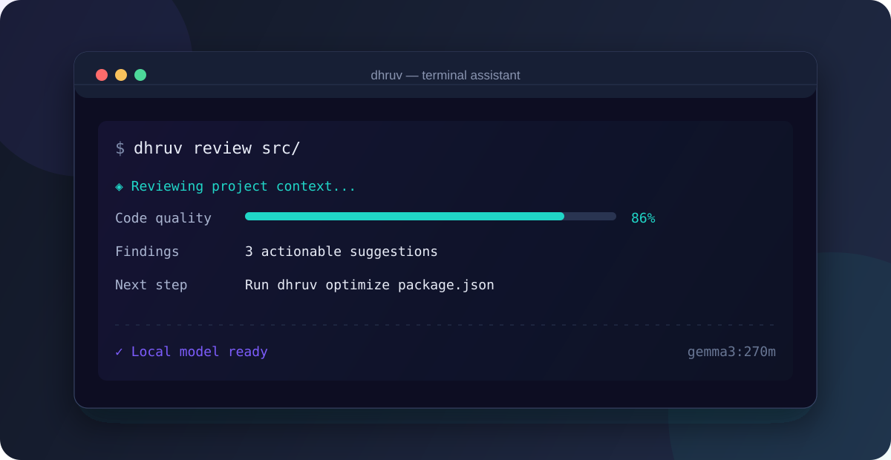

<p align="center">
  <a href="https://github.com/rahul05ranjan/dhruv-cli">
    <strong>⚡ Dhruv CLI</strong>
  </a>
</p>

<p align="center">
  A local-first AI command center for your terminal.
</p>

<p align="center">
  Ask better questions. Understand unfamiliar code. Ship with confidence.
</p>

<p align="center">
  <a href="https://rahul05ranjan.github.io/dhruv-cli/">Website</a>
  ·
  <a href="https://www.npmjs.com/package/@rahul05ranjan/dhruv-cli">npm</a>
  ·
  <a href="https://github.com/rahul05ranjan/dhruv-cli/issues">Issues</a>
  ·
  <a href="CONTRIBUTING.md">Contributing</a>
</p>

<p align="center">
  <a href="https://github.com/rahul05ranjan/dhruv-cli/actions/workflows/deploy.yml"></a>
  <a href="https://www.npmjs.com/package/@rahul05ranjan/dhruv-cli"></a>
  <a href="https://www.npmjs.com/package/@rahul05ranjan/dhruv-cli"></a>
  
</p>

<p align="center">
  
</p>

## Why Dhruv?

Dhruv brings a focused AI toolkit into the terminal, powered by local Ollama models. It keeps your workflow close to the codebase, works without a hosted AI account, and turns everyday developer questions into fast, actionable output.

<table>
  <tr>
    <td width="33%"><strong>✦ Think with you</strong><br>Explain concepts, suggest approaches, and turn errors into clear next steps.</td>
    <td width="33%"><strong>◈ Inspect deeply</strong><br>Review code, optimize files, and scan projects for common security risks.</td>
    <td width="33%"><strong>⌁ Fit your flow</strong><br>Use an interactive menu, shell completion, JSON output, or your own plugins.</td>
  </tr>
</table>

## Start in 60 seconds

### 1. Install Dhruv

```bash
npm install -g @rahul05ranjan/dhruv-cli
```

### 2. Start a local model

Install [Ollama](https://ollama.com/), then run:

```bash
ollama serve
ollama pull gemma3:270m
```

### 3. Configure once, then go

```bash
dhruv init
dhruv suggest "how should I structure this Node.js service?"
```

Dhruv requires Node.js 18 or newer. The default model is `gemma3:270m`; choose any model available in your Ollama installation during setup.

## A command surface built for shipping

| Command | What it does |
| --- | --- |
| `dhruv suggest <query>` | Generate practical suggestions for a development task |
| `dhruv explain <query>` | Explain a concept, command, or unfamiliar error |
| `dhruv fix <query>` | Analyze a coding issue and propose a fix |
| `dhruv review <file-or-dir>` | Review up to ten code files for quality and maintainability; add `--diff` for uncommitted changes |
| `dhruv optimize <file>` | Find actionable improvements for source or configuration files |
| `dhruv security-check [file-or-dir]` | Run a redacted local security analysis; add `--strict` for CI failure on high-confidence findings |
| `dhruv generate <type> <target>` | Preview generated tests by default; use `--apply`, `--output`, or `--overwrite` to write safely |
| `dhruv status` | Check Ollama connectivity and configured models |
| `dhruv health` | Show a concise health summary; use `--details` for diagnostics |
| `dhruv metrics` | Inspect local usage and performance metrics; use `--raw` or `--reset` explicitly |
| `dhruv project-type` | Detect the current project type |
| `dhruv menu` | Open the interactive command palette |
| `dhruv completion [shell]` | Generate Bash, Zsh, or Fish completion |

### Common workflows

```bash
# Understand and plan
dhruv explain "git rebase vs merge"
dhruv suggest "deploy a React app to Vercel"

# Improve an existing project
dhruv review src/
dhruv review --diff .
dhruv optimize package.json
dhruv security-check src/
dhruv security-check src/ --strict

# Generate and automate
dhruv generate tests src/utils/helpers.js       # preview only
dhruv generate tests src/utils/helpers.js --apply
dhruv completion zsh > ~/.zsh/completions/_dhruv
```

## Configuration that stays out of your way

Run `dhruv init` to set the Ollama model, response format, verbosity, terminal theme, and whether settings are project-local or user-global. Local configuration is stored in `.dhruv-config.json`; global settings live under your user config directory.

For one-off runs, use global flags:

```bash
dhruv suggest "summarize this migration" --model llama3.2 --json
dhruv review src/ --verbose
dhruv explain "what changed?" --timeout 60000
```

## Extend it with plugins

Drop an ESM module into your project's `plugins/` directory. Dhruv loads `.js` plugins before parsing the command line, so you can add commands without changing the core CLI.

```js
// plugins/hello.js
export default (program) => {
  program
    .command('hello-plugin')
    .description('Say hello from a project plugin')
    .action(() => console.log('Hello from Dhruv!'));
};
```

Then run:

```bash
dhruv hello-plugin
```

## Documentation & project guides

| Resource | Link |
| --- | --- |
| Product site | [rahul05ranjan.github.io/dhruv-cli](https://rahul05ranjan.github.io/dhruv-cli/) |
| API reference | [Generated TypeDoc](https://rahul05ranjan.github.io/dhruv-cli/api/) |
| Contributing | [CONTRIBUTING.md](CONTRIBUTING.md) |
| Security policy | [SECURITY.md](SECURITY.md) |
| Publishing notes | [docs/publishing-fix.md](docs/publishing-fix.md) |

## Development

```bash
npm install
npm run type-check
npm test
npm run lint
npm run build
```

## License

MIT © [Rahul Ranjan](https://github.com/rahul05ranjan)
